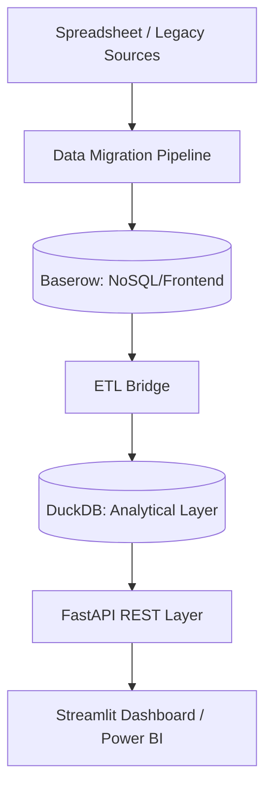

# Project Data Management & Analytics System

## 📌 Context
In my current role at **Lee Wakemans**, I am leading the digital transformation of project operations. Historically, data was fragmented across multiple spreadsheets, leading to synchronization issues and high manual overhead.

## 🚀 The Solution
I designed and deployed a centralized **Relational Data System** that serves as the single source of truth for all live projects.

## 🏗️ System Architecture
The system utilizes a **Hybrid Relational Architecture**, combining high-performance analytical processing (OLAP) with a flexible project management interface.

## 🛠️ Requirements-to-Implementation Mapping
| Requirement | Implementation Anchor | Output |
|-------------|-----------------------|--------|
| Centralized Truth | `BaserowClient` | Relational Entity Store |
| High-Speed Analytics | `DuckDB Engines` | Sub-second Query Reponse |
| Access Control | `FastAPI Dependencies` | Role-Based Authorization |
| Data Lifecycle | `ETL Scripts` | Automated Synchronization |

### 🛠️ Technical Stack
- **Backend:** FastAPI (Python) for API logic.
- **Database:** DuckDB (OLAP) & Baserow (NoSQL front-to-relational).
- **Frontend/BI:** Streamlit & Power BI.
- **Concepts:** SQL Joins, Aggregations, Access Controls, and Data Lifecycle Management.

## 📈 Measured Impact
- **70% Reduction** in spreadsheet dependency.
- **100% Data Integrity** across 10+ live major projects.
- **Secure Access:** Implemented role-based access for 15+ internal users.

## 📂 Featured Implementation: [app.py](cci:7://file:///c:/Users/ACER/.gemini/antigravity/playground/fractal-spicule/projects/02-project-data-system/app.py:0:0-0:0)
The provided [app.py](cci:7://file:///c:/Users/ACER/.gemini/antigravity/playground/fractal-spicule/projects/02-project-data-system/app.py:0:0-0:0) is a simplified architectural demonstration of the Streamlit dashboard used to visualize project health and resource allocation. It mimics the data-flow from DuckDB to the end-user.

---
*Developed for Lee Wakemans - Digital Transformation Initiative.*
