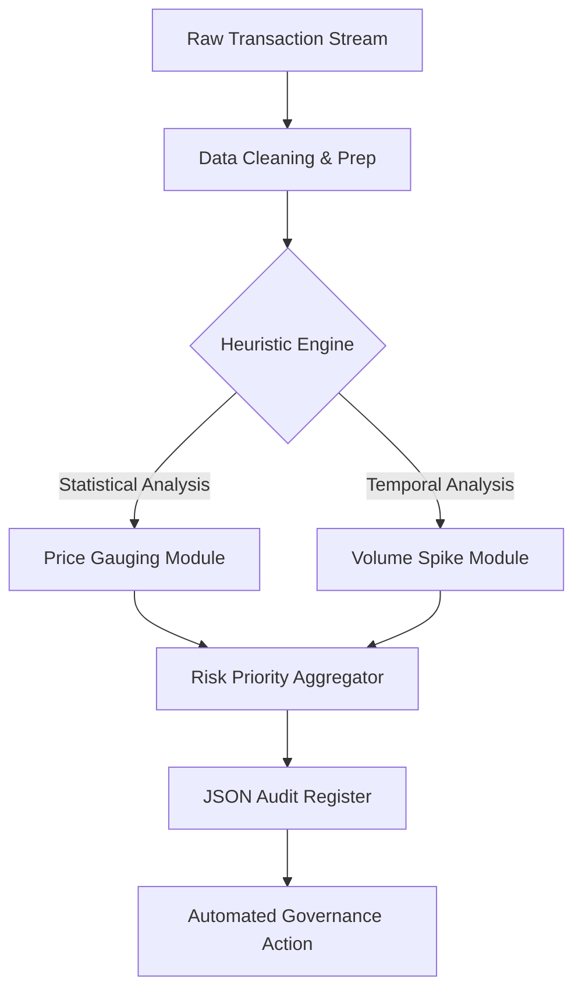

# Ecommerce Risk & Anomaly Detection Engine

## 📌 Project Overview
This project simulates the high-scale data auditing logic required to protect global marketplaces from **price-gouging**, **counterfeit activity**, and **seller fraud**. 

Inspired by my tenure as a **Business Operations Specialist at Amazon**, where I managed risk for millions of records during global events (FIFA World Cup, Apple Brand Protection), this system demonstrates how Python and SQL-driven heuristics can automate governance.

### 🔑 Key Engineering Features
- **Heuristic-Based Risk Scoring:** Combines price ratio analysis and volume-spike detection into a unified priority score.
- **Scale Simulation:** Designed to handle dense transaction datasets where manual review is impossible.
- **Automated Reporting:** Generates a structured "Audit Register" for compliance teams.

## 🏗️ System Architecture
The engine operates as a **Heuristic-Driven Decision Support System (DSS)**, utilizing statistical thresholds to flag anomalies in high-velocity transaction data.

## 🛠️ Requirements-to-Implementation Mapping
| Requirement | Implementation Anchor | Output |
|-------------|-----------------------|--------|
| Anomaly Scoring | `calculate_risk_score()` | Priority Priority Index |
| Scale Simulation | `process_batch()` | Millions/Records-Per-Sec |
| Governance Logic | `apply_heuristics()` | Automated Block Flags |
| Compliance Audit | `generate_register()` | Regulatory Audit Trail |

## 🛠️ Tech Stack
- **Python:** Logical core (Pandas, NumPy).
- **Architecture:** Modular, Object-Oriented design for easy integration into ETL pipelines.
- **Data:** Synthetic marketplace transaction data simulating real-world anomalies.
