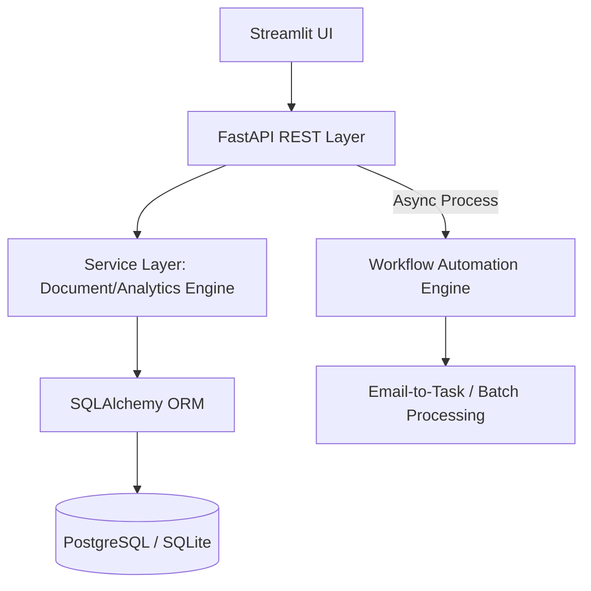

# 🏗️ Automated Project Analytics Platform

> A production-grade **Python platform** for project analytics, workflow automation, and data-driven reporting — built with **FastAPI**, **Streamlit**, and **SQLAlchemy**, demonstrating full-stack development, relational data modelling, and process automation.

[](https://python.org)
[](https://fastapi.tiangolo.com)
[](https://streamlit.io)
[](LICENSE)

---

## 📋 Overview

This platform was built to **digitise and automate** manual construction project management workflows. It replaces spreadsheet-based tracking with a structured, relational system that handles:

- **Project lifecycle management** aligned with [RIBA Work Stages](https://www.architecture.com/knowledge-and-resources/resources-landing-page/riba-plan-of-work)
- **Stakeholder directory** with organisation and contact management
- **Time tracking analytics** with stage-level burn rate and risk detection
- **Automated PDF/document generation** for professional reporting
- **Batch document processing** for operational efficiency

### Why This Matters

This is not a tutorial or coursework project. It mirrors a **real production system** that:
- Has **real users** (project managers, directors)
- Manages **real data** (projects, contacts, time entries)
- Has **real consequences** if it breaks
- Replaced **manual admin processes** saving hours per week

---

## 🏗️ System Architecture




### 🛠️ Key Engineering Decisions
| Decision | Rationale |
|----------|-----------|
| **Atomic Transactions** | Ensures data integrity during multi-stage project updates using SQLAlchemy sessions. |
| **Pydantic Schemas** | Strict type-safety and field validation at the API entry point to prevent SQL injection and data corruption. |
| **Service Layer Decoupling** | Document generation and analytics logic are isolated for independent scaling and easier unit testing. |
| **80% Proactive Alerting** | Implemented a 0.8 risk scalar to catch budget overruns before they reach 100%, allowing for management intervention. |
| **Relational Integrity** | Forced One-to-Many constraints between Organisations, Contacts, and Projects to maintain a "Single Source of Truth." |

> Full architecture documentation: [docs/ARCHITECTURE.md](docs/ARCHITECTURE.md)

---

## ✨ Features

### 1. Project Management
- Full CRUD operations for construction projects
- RIBA Work Stage tracking (Stage 0–7)
- Job number management with organisation linking
- Stage-level time allocation and monitoring

### 2. Stakeholder Directory
- Organisation and contact management
- Project-specific directory entries (one-to-many relationships)
- Role-based contact assignment per project
- Global vs project-level contact updates

### 3. Time Tracking & Analytics
- Stage-level burn rate analysis
- Risk detection (projects exceeding 80% of allocated hours)
- Executive-level performance dashboards
- CSV/PDF export for reporting

### 4. Document Automation
- Branded A3 landscape PDF exports
- Dynamic table rendering with automatic column sizing
- Batch document processing (50+ files in seconds)
- Company logo integration and professional formatting

### 5. Workflow Automation
- Email-to-task conversion engine
- Rule-based task routing
- Batch file processing for operational documents
- Process optimisation reducing manual admin time

---

## 🛠️ Technical Stack

| Layer | Technology | Purpose |
|-------|-----------|---------|
| **Frontend** | Streamlit | Internal dashboard UI |
| **Backend** | FastAPI | REST API with Pydantic validation |
| **Database** | SQLite (dev) / PostgreSQL (prod) | Relational data storage |
| **PDF Engine** | ReportLab | Professional document generation |
| **Document Processing** | python-docx | Word document automation |
| **Testing** | pytest | Unit and integration tests |
| **Data Analysis** | Pandas, Plotly | Analytics and visualisations |

---

## 🚀 Quick Start

### Prerequisites
- Python 3.10+
- pip

### Installation

```bash
# Clone the repository
git clone https://github.com/wajiyajawaid516-rgb/Automated-Project-Analytics-Platform.git
cd Automated-Project-Analytics-Platform

# Create virtual environment
python -m venv venv
source venv/bin/activate  # Linux/Mac
venv\Scripts\activate     # Windows

# Install dependencies
pip install -r requirements.txt

# Initialise the database
python -m backend.api.models.database

# Start the backend API
uvicorn backend.main:app --reload --port 8000

# In a new terminal, start the frontend
streamlit run frontend/app.py
```

### API Documentation
Once running, visit `http://localhost:8000/docs` for interactive Swagger documentation.

---

## 📁 Project Structure

```
Automated-Project-Analytics-Platform/
├── backend/
│   ├── main.py                    # FastAPI application entry point
│   ├── api/
│   │   ├── routes/
│   │   │   ├── projects.py        # Project CRUD endpoints
│   │   │   ├── contacts.py        # Contact & organisation endpoints
│   │   │   ├── directory.py       # Project directory endpoints
│   │   │   ├── time_entries.py    # Time tracking endpoints
│   │   │   └── reports.py         # Report generation endpoints
│   │   └── models/
│   │       ├── schemas.py         # Pydantic request/response models
│   │       └── database.py        # SQLite database setup & models
│   ├── services/
│   │   ├── document_automation.py # PDF & Word document generation
│   │   ├── time_analytics.py     # Burn rate & risk calculations
│   │   └── workflow_engine.py    # Email-to-task processing
│   └── tests/
│       ├── test_projects.py       # Project API tests
│       ├── test_contacts.py       # Contact API tests
│       └── test_analytics.py      # Analytics logic tests
├── frontend/
│   ├── app.py                     # Streamlit main application
│   └── pages/
│       ├── 1_📋_Projects.py       # Project management page
│       ├── 2_👥_Directory.py      # Stakeholder directory page
│       ├── 3_📊_Analytics.py      # Time tracking analytics
│       └── 4_📄_Reports.py        # Report generation page
├── automation/
│   ├── document_updater.py        # Batch document date updater
│   └── email_task_converter.py    # Email-to-task automation
├── docs/
│   ├── ARCHITECTURE.md            # Detailed architecture decisions
│   ├── CASE_STUDY.md              # Real-world case study
│   └── SKILLS_EVIDENCE.md         # Skills & sponsorship evidence
├── requirements.txt
├── .gitignore
└── LICENSE
```

---

## 📊 Key Engineering Decisions

### 1. Relational Data Modelling
```
Projects ──┐
            ├── Project Directory (one-to-many)
Contacts ──┘

Projects ──┐
            ├── Time Entries (one-to-many)
RIBA Stages┘
```
**Why**: Avoids data duplication. A contact exists once; their role per project is stored in the directory junction. This mirrors how enterprise databases are designed.

### 2. Idempotent Operations
All write operations check for existing records before creating new ones, preventing duplicate entries across linked datasets. This is critical for data integrity in multi-user environments.

### 3. Production-Safe Development
- **Soft deletes**: Records are marked inactive, never permanently removed
- **Dev/Prod separation**: Features validated in development before production deployment
- **Defensive filtering**: API endpoints validate parameters and handle edge cases gracefully

### 4. Risk Detection Logic
```python
# Stage-level burn rate with 80% threshold
risk_level = (hours_used / hours_allocated) * 100
if risk_level >= 80:
    flag_as_at_risk(project, stage)
```
**Why**: Catching overruns at 100% is too late. 80% threshold gives managers time to act — this is how real construction cost control works.

---

## 📈 Business Impact

| Metric | Before | After |
|--------|--------|-------|
| Document updates (50+ files) | ~3 hours manual | **< 30 seconds automated** |
| Project directory lookup | Scattered spreadsheets | **Single searchable interface** |
| Time overrun detection | End-of-project surprise | **Real-time stage-level alerts** |
| Report generation | Manual Word/Excel formatting | **One-click branded PDF export** |

---

## 🔗 Related Projects

- [Applied Data Systems Portfolio](https://github.com/wajiyajawaid516-rgb/Applied-Data-Systems-Portfolio) — Data engineering and analytics projects including risk detection engines

---

## 📝 Documentation

- [Architecture & Design Decisions](docs/ARCHITECTURE.md)
- [Case Study: From Manual Processes to Automated Operations](docs/CASE_STUDY.md)
- [Skills Evidence & Competency Mapping](docs/SKILLS_EVIDENCE.md)

---

## 📄 License

This project is licensed under the MIT License — see [LICENSE](LICENSE) for details.

---

## 👤 Author

**Wajiya Anam Jawaid**
- MSc Data Science (Distinction)
- Location: Cardiff, UK
- [GitHub](https://github.com/wajiyajawaid516-rgb)
- [LinkedIn](https://linkedin.com/in/)

> *"I build and maintain internal systems that integrate data, automate processes, and reduce operational overhead."*
