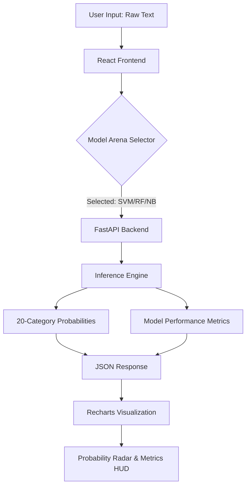

# OmniClassify AI — Semantic Benchmarking Portal

> A full-stack Machine Learning inference dashboard that benchmarks multiple text classification models across 20 distinct categories. Derived from MSc Data Science research.

## 🏗️ System Architecture
The following diagram illustrates the data flow from client-side input to server-side ML inference and comparative benchmarking.



## 🛠️ Technical Implementation
- **Frontend**: React (Vite) + Tailwind CSS + Lucide Icons.
- **Analytics**: Recharts for dynamic probability distribution mapping.
- **Backend**: FastAPI (Python) serving serialized ML models.
- **Algorithms**: Benchmarked SVM (Support Vector Machine), Random Forest, and Multinomial Naive Bayes.
- **Dataset**: Trained on the 20-Newsgroups dataset (18,000+ documents).

## 🔬 Scientific Methodology
This project moves beyond simple classification by focusing on **Model Interpretability** and **Comparative Evaluation**.
1. **Benchmarking**: Real-time display of F1-Score and Accuracy per model.
2. **Distribution**: Probabilistic mapping over 20 categories to show latent variance.
3. **Productization**: Transforming academic notebooks into a production-ready SaaS interface.

## 🚀 Installation & Setup
```bash
# To run the backend
cd backend
pip install fastapi uvicorn
uvicorn main:app --reload

# To run the frontend
cd frontend
npm install
npm run dev
```
